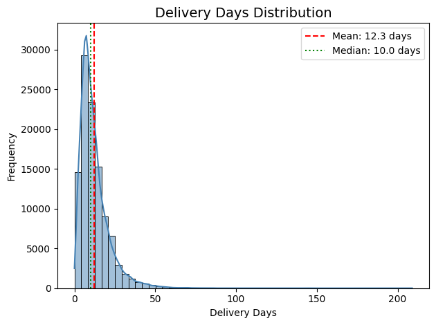
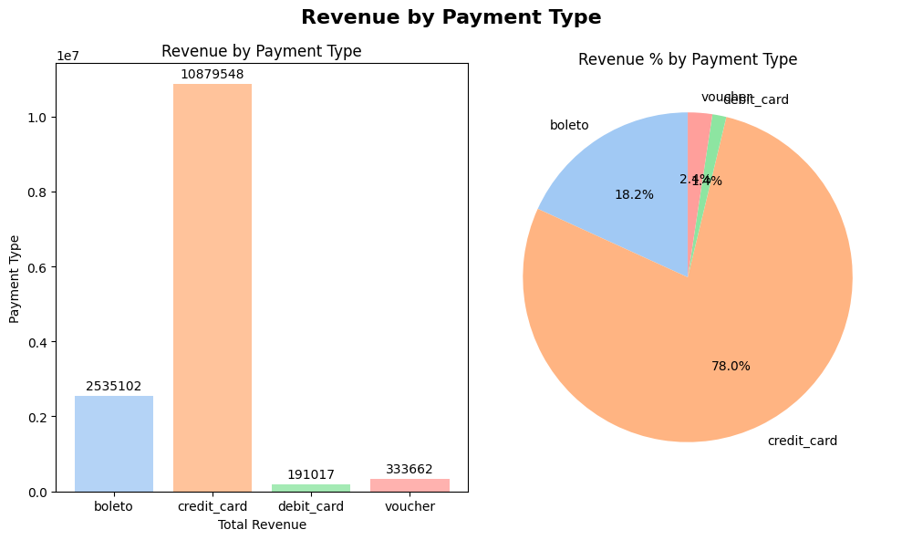
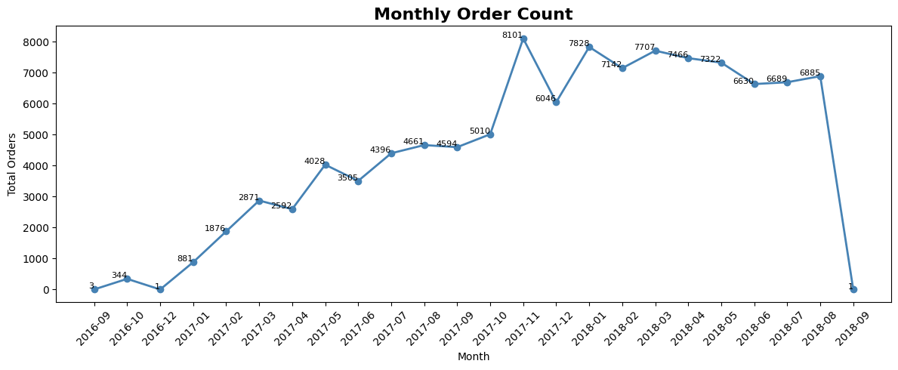

# Brazilian E-Commerce Data Analysis (Olist)

## Overview
This project analyzes the Brazilian E-Commerce Public Dataset by Olist to uncover actionable business insights related to customer behavior, sales trends, payment preferences, product performance, and delivery efficiency.

The analysis combines data cleaning, exploratory data analysis (EDA), and SQL-based relational analysis to transform raw transactional data into meaningful business intelligence for data-driven decision-making.

---

## Dataset
- **Dataset:** Olist Brazilian E-Commerce Dataset  
- **Source:** Kaggle  
- **Records:** 100,000+ e-commerce orders  
- **Dataset Link:** https://www.kaggle.com/datasets/olistbr/brazilian-ecommerce  

### Main Tables Used
- Customers
- Orders
- Order Items
- Payments
- Reviews
- Products
- Sellers

---

## Project Objectives
The primary objectives of this project are to:

- Analyze customer purchasing behavior
- Identify trends in sales and order activity
- Evaluate delivery performance and delays
- Study payment preferences and transaction patterns
- Discover high-performing product categories
- Prepare clean and structured data for reporting and visualization

---

## Data Cleaning & Preprocessing
The following preprocessing steps were performed to improve data quality and consistency:

- Handled missing values in review comments and product-related fields
- Removed duplicate records across multiple tables
- Converted date columns into datetime format
- Merged relational datasets using common keys
- Dropped irrelevant and high-cardinality columns
- Standardized column formats and ensured data consistency

---

## Exploratory Data Analysis (EDA)

### Customer & Order Analysis
- Analyzed monthly order trends and seasonality
- Examined customer purchase frequency
- Identified repeat customer behavior patterns

### Product & Revenue Analysis
- Studied product price distributions
- Evaluated freight cost patterns
- Identified top-performing product categories by revenue

### Delivery Performance Analysis
- Calculated delivery durations
- Analyzed delayed deliveries
- Examined the relationship between delivery delays and review scores

### Statistical Analysis
- Computed mean, median, and mode for key numerical features
- Identified outliers using the IQR method

---

## SQL-Based Relational Analysis
SQL queries were used to perform relational analysis across multiple tables, including:

- Orders ↔ Customers
- Orders ↔ Payments
- Orders ↔ Order Items
- Orders ↔ Reviews

### Key SQL Insights
- Total revenue trends over time
- Most frequently used payment methods
- Customer order frequency analysis
- Revenue contribution by product category
- Delivery delay analysis
- Customer satisfaction trends

---

## Key Insights
- Credit cards are the most preferred payment method among customers
- Delivery delays negatively affect customer review scores
- A small number of product categories contribute significantly to total revenue
- Repeat customers play an important role in overall sales generation
- Freight charges vary considerably across product categories

---

## Technologies Used

### Programming & Analysis
- Python
- Pandas
- NumPy

### Database & Querying
- SQL
- MySQL-style queries

### Data Visualization
- Matplotlib
- Seaborn

### Business Intelligence
- Power BI

---

## Sample Visualizations

### Delivery Days Distribution

### Revenue by Payment Type

### Monthly Order Count

---

## Future Improvements
- Develop an interactive Power BI dashboard
- Build predictive models for customer segmentation and churn prediction
- Automate the data preprocessing pipeline
- Perform advanced customer cohort analysis
- Create recommendation system prototypes
